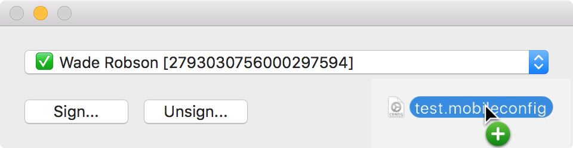

> PSU MacAdmins Hackathon 2016   
> ###### Award Winner  
> Biggest time saver

## Hancock

Hancock is a GUI tool for signing packages and mobileconfig files. First it looks through your keychain for all certificates that can be used to sign, then signs the files using the selected certificate.  

It can also unsign mobileconfig files, giving the user the ability to then read or make changes to mobileconfig file already signed. 

## Requirements
At least one certificate with a private key installed. This could be an Apple Developer certificate or as simple as a free Comodo email cert.  

### Signing
1. Select a valid certificate from the dropdown.

2. Select the mobileconfig/pkg to sign by clicking **Sign...**. You are also able to drag and drop.

3. You will get prompted to allow access to your keychain. Choose **Allow** or choose **Always Allow**, if you plan on using that certificate again.

4. Choose where you want to save the signed file.

### Certificate Status
Any certificate listed in the drop down can be used to sign. The icons tell you if the certificate is fully trusted by the system or not. 
✅ Trusted by system. 
⚠️ Not Trusted by system.

### Unsigning

If you want to make changes to a signed mobileconfig file, or it you want to view the contents you will need unsign the mobileconfig file first. This can be accomplished by clicking the **Unsign...** button and selecting the mobileconfig file to unsign.
**_\*NOTE: Unsigning pkgs is not supported._**

## Acknowledgements
This project was inspired Nick McSpadden's [Profilesigner](https://github.com/nmcspadden/ProfileSigner). A command line utility for signing mobileconfig files. If you're looking for a cli method I suggest you check it out.

