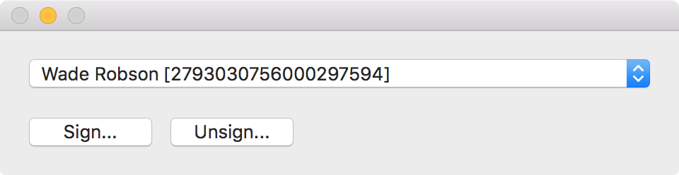

> PSU MacAdmins Hackathon 2016 submission.

## Overview

Hancock provides an easy way to sign mobileconfig files. Hancock looks through your keychain for any certificate that can be used to sign.

### Signing
1. Select a valid certificate from the dropdown.

2. Select the mobileconfig file to sign by clicking **Sign...**. You are also able to drag and drop.

3. You will get prompted to allow access to your keychain. Choose **Allow** or choose **Always Allow**, if you plan on using that certificate again.

4. Choose where you want to save the signed mobileconfig file.

### Unsigning
If you want to make changes to a signed certificate, or it you want to view the contents you will need unsign the mobileconfig file first. This can be accomplished by clicking the **Unsign...** button and selecting the mobileconfig file to unsign.
